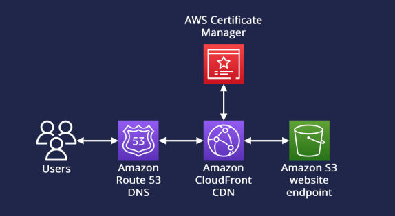
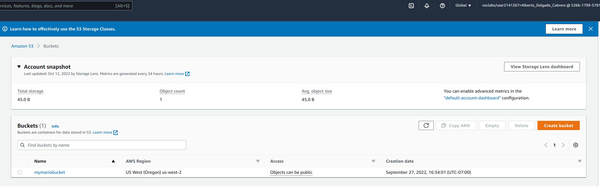
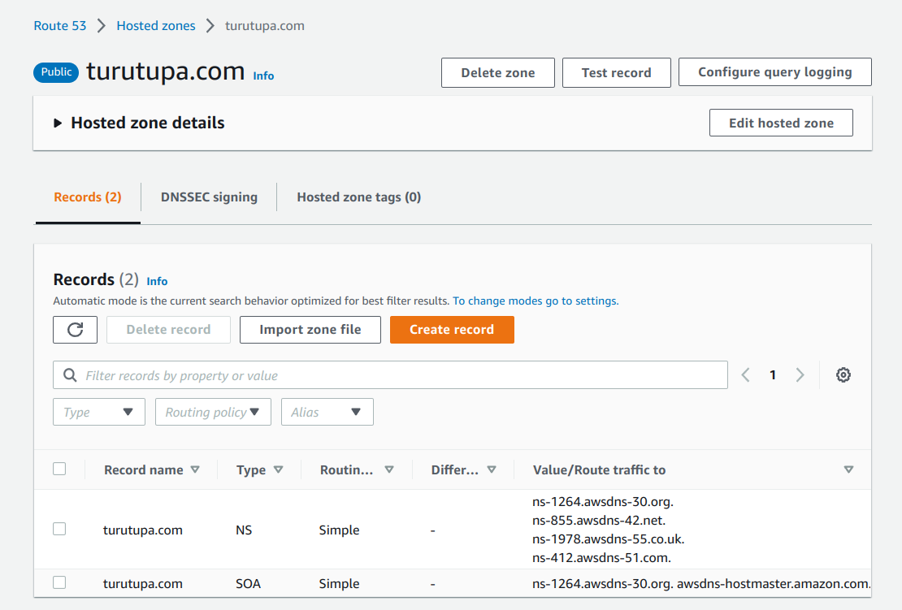
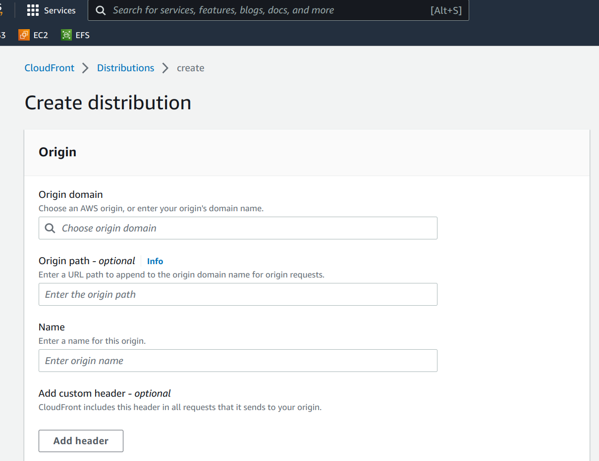
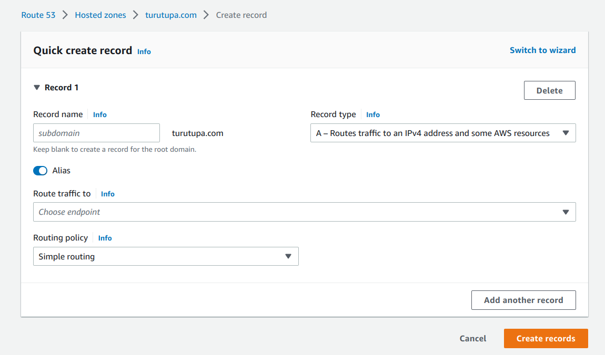

# Serving static content: AWS Edition

## <span style="color:pink">**-TLDR-**</span> 
This blog explains how to store static content in the cloud in a secure manner and how to access it __*BLAZINGLY*__ fast through your own domain! 

## Intro
You ever wanted to store pictures of cat hats in the cloud but never had the time to figure out how? We will cover it in a few easy steps! In this tutorial we will explain how to store static content in AWS S3 Buckets, how to handle permissions, how to make the files __*BLAZINGLY*__ fast to load and how to use your own domain to access them!

This is the architecture for today's blog:



---
1. <span style="color:pink">**S3 - Cloud Storage**</span>
2. Route53 - Use your own domain
3. Certificate Manager - Seal of approval
4. CloudFront - Serve S3 content from cached edge locations 

## S3 - Cloud Storage
The first step into building our cat hats vault is setting up AWS S3. What is S3? 
> Amazon Simple Storage Service (Amazon S3) is an object storage service that offers industry-leading scalability, data availability, security, and performance. 

What does this mean for us? It means we found the perfect place to store our pictures as it provides high availability at a very cheap price. In S3 data is stored in buckets. Let's create our first one:
1. Go to `Services` - top left corner - and click on `S3`, you might have to search for it
2. Create new bucket by clicking on the `Create Bucket` orange button - keep the recommended settings including block from public access. Try to give it a meaningful name. Once created you should see it in the bucket list.

   You should be able to see the newly created bucket:
   

3. Click on your bucket and upload your own `index.html` by selecting the `Upload` button. This can be a very basic `html` for now.
4. (Optional) Upload some sample pictures by clicking on the `Upload` button. You can also try to keep things a bit tidy by creating first a new folder called `images` and then placing the images there. Up to you!
5. Click on properties and scroll to `Static website hosting` > `Edit` > `Enable`. Enter `index.html` for both `Index document` and `Error document - optional`. Click `Save changes`.
6. You should be back at your bucket overview page. Go to the `Permissions` tab and under `Bucket policy` click on `Edit`. In order to make it publicly accessible we are going to add the following policy:
 ```
{
  "Id": "Policy1665772831180",
  "Version": "2012-10-17",
  "Statement": [
    {
      "Sid": "Stmt1665772684066",
      "Action": [
        "s3:GetObject"
      ],
      "Effect": "Allow",
      "Resource": "arn:aws:s3:::<INSERT HERE YOUR BUCKET NAME>/*",
      "Principal": "*"
    }
  ]
}
```
Click on `Save changes`.

---
1. S3 - Cloud Storage
2. <span style="color:pink">**Route53 - Use your own domain</span>**
3. Certificate Manager - Seal of approval
4. CloudFront - Serve S3 content from cached edge locations

## Route53 - Use your own domain
So far we know where are content is but... what about our dearest friends and family? We want a painless way for them to access our site. Route53 is a `highly available and scalable Domain Name System (DNS) web service.` What this means is that not only your content will be available through a domain name instead of an IP address, it will also be smart enough to perform load balancing and change the origin address based on load! To get started you will need your own domain. You can head to [Freenom](https://www.freenom.com/) for a free domain if you don't have one. This [video](https://www.youtube.com/results?search_query=freenom+route53) can be very helpful too. After that you can:
1. Go to `Services` - top left corner - and click on `Route53`
2. Click on `Created hosted zone`
3. In domain name insert the name of your domain
4. Click on `Create hosted zone`. You should get something similar to this:

5. Under records, in the `Value/Route traffic to` column are the nameservers. These are the ones in charge of translating domain names into IP addresses.
6. If you used Freenom, you can follow the linked video to add these nameservers to your domain management system. If you are using a different service, you'll have to figure out how to add these nameservers.

That's it for now. Although Route53 is not yet pointing to our `index.html` in `S3` we will come back to it later. We need security!

---
1. S3 - Cloud Storage
2. Route53 - Use your own domain
3. <span style="color:pink">**Certificate Manager - Seal of approval</span>**
4. CloudFront - Serve S3 content from cached edge locations

## Certificate Manager
Security is of the essence. We don't want those damn hackers stalking over our connections to our wonderful website. Fortunately, AWS will handle that for us. AWS Certificate Manager provisions, manages and deploys public and private SSL/TLS certificates to use with other AWS services. 
1. Go to `Services` - top left corner - and click on `Certificate Manager`
2. Select `Request a certificate` and keep `Request a public certificate` selected. Click on `Next`
3. You may want to add both `your-domain.com` and `www.your-domain.com` under `Fully qualified domain name`. Leave `DNS validation` checked
4. Select `Request`
5. You should see the certificate in `Pending validation` status. Click on the `Certificate ID`
6. Select `Create records in Route 53` under domains and then again `Create records`


Great progress! We are now ready to store safely infinite amount of cat hat pictures! Let's now make them accessible through AWS Cloudfront, so we can access them __*BLAZINGLY*__ fast. 

---
1. S3 - Cloud Storage
2. Route53 - Use your own domain
3. Certificate Manager - Seal of approval
4. <span style="color:pink">**CloudFront - Serve S3 content from cached edge locations</span>**

## CloudFront - Serve S3 content from cached edge locations
We sure want our pictures to be shared worldwide, but we also want them to be delivered fast to every user. How can we achieve this? Well, one way to put it would be `if the mountain will not come to Mahomet, Mahomet must go to the mountain`. What does this mean? CloudFront will cache your data worldwide in what it is called edge locations so that on each request the data is delivered with the best performance possible, that is, from the datacenter closest to the user request. Let's get to it:
1. Go to `Services` - top left corner - and click on `CloudFront`, again, you might have to search for it
2. Click on create `Create Distribution`
3. Under `Origin Domain Name` select the bucket you created previously - you should see it in the dropdown box
4. Under `Default Cache Behavior` you can select `Redirect HTTP to HTTPS`
5. (Optional) Set `Restrict Viewer Access` to yes to ensure the images are only access through CloudFront.
6. For `Alternate domain name (CNAME)` insert your domain name, for example `your-domain.com`
7. And for `Custom SSL certificate` select the previously created certificate

Voila! We now have a super fast and secure infrastructure serving our static content!



---
1. S3 - Cloud Storage
2. <span style="color:pink">**Route53 - Use your own domain</span>**
3. Certificate Manager - Seal of approval
4. CloudFront - Serve S3 content from cached edge locations

## Route53 - Use your own domain - last touch!
We are almost there!

Now that we have set up CloudFront we want Route53 to target this new service. Otherwise, how are we gonna to access our website?

1. Go to `Services` - top left corner - and select `Route53`
2. Select your previously created hosted zone
3. Click on `Create record`. 
4. Leave `Record type` as `A` record but mark the `Alias` check. It should look something like:

5. Under `Route traffic to` select `Alias to CloudFront distribution` and when clicking on the search box `Choose distribution` you should be able to choose the previously created CloudFront distribution
6. Select `Create records` and that's it! 

## Done!
It was a long journey but if you managed to follow all the steps you just hosted your own website, accessible through Route53 for stable routing and load balancing and fast distribution thanks to CloudFront. 

Only steps missing is keep expanding your website and show the world the glory of the cat hats!