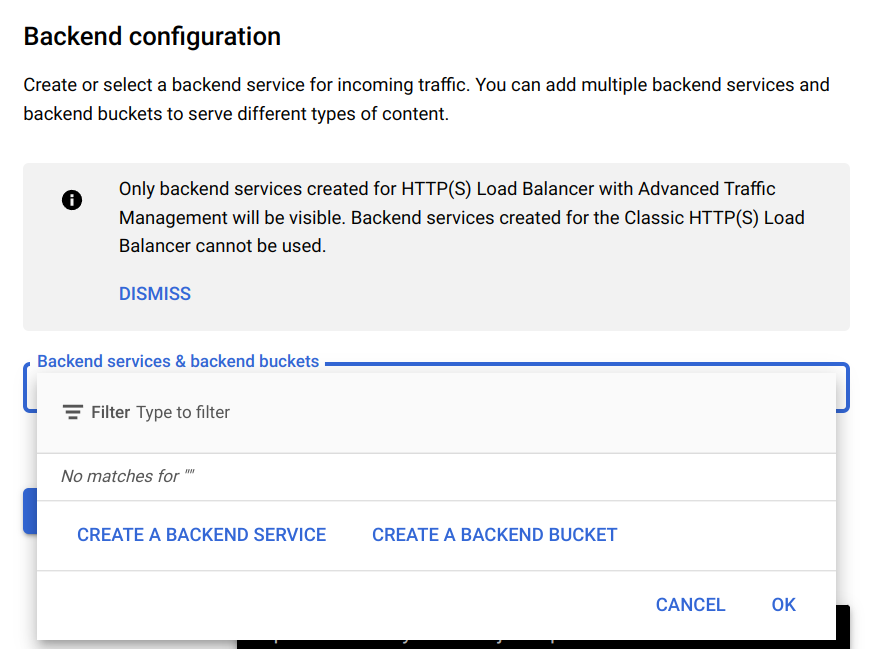

# Serving static content: GCP Edition

## **-TLDR-** 
This blog explains how to store static content in the cloud in a secure manner and how to access it __*BLAZINGLY*__ fast through your own domain using Google Cloud Platform! We will use Google Cloud Storage to save static content, Cloud CDN to make it highly available for everyone, Cloud DNS to add our own domain and 

---
1. **Google DNS**
2. Google Cloud Storage
3. Google Cloud CDN

## Google DNS
In order to access the static content we are first going to register our own domain. If you don't have a domain you can always get one for free at [Freenom](https://www.freenom.com/). Google DNS is going to route the requests to our domain to the resource we are going to create later on, on Google Storage. For now, let's set up a cloud DNS management:
1. Go to the magnifying glass at the top and search for `Cloud DNS`. You should find a result under the category `Network Services`
2. Click on `Create zone`. You should now see something like this

3. Set `Zone type` as `Public`
4. In zone name you can enter whatever you want, for example `my-new-zone`
5. In the `DNS name` enter the name of the free domain you obtained from [Freenom](https://www.freenom.com/) our if you already had one enter the name. For example: `example.com`
6. Select `DNSSEC` and click on `Off`
7. `Create`!
8. You should have been redirected to an overview page. Under `Data` you can see the nameservers ending in `*.googledomains.com`. These are web services in charge of translating domain names into IP addresses. Use these nameservers in Freenom if you used that provider ([step-by-step guide](https://my.freenom.com/knowledgebase.php?action=displayarticle&id=3)) or if you used another provider search yourself on how to do so.
9. Almost done. GCP requires that you verify your domain ownership. 
> If your project intends to have a domain-named bucket, the team member creating the bucket must demonstrate that they are authorized to create a bucket in the given domain.
10. Go to [Google Search Console](https://search.google.com/search-console/welcome?utm_source=about-page) and enter your domain's name. You should then get something similar to:

11. Next, we will follow the steps from the popup. Without closing this tab, go to `Cloud DNS` in a new tab as we did in step 1, to the zone we previously created and click on `Add record set`.
12. Create a new record of type `TXT` and in `TXT data` insert the TXT record from the popup (the long key). Select `Create`!
13. Go back to the previous popup from step 10 and select `VERIFY` again. Be patient, sometimes it takes some time
    
If you had any problems with the last steps the [support page](https://support.google.com/webmasters/answer/9008080#domain_name_verification&zippy=%2Cdomain-name-provider) may help troubleshooting.

That's it for now. We will now proceed to create the storage buckets for your content!

---
1. Google DNS
2. **Google Cloud Storage**
3. Google Cloud CDN

## Google Cloud Storage
What is Google Cloud Storage (GCS)? It's a service for storing your static content. It can be of any kind, such as html, images, json files, anything. These files are immutable and in GCS they are called `objects`. `Objects` are stored in containers called `buckets`. Let's create our first bucket!

1. Go to the magnifying glass at the top and search for `Cloud Storage`, you should get a result under `Enterprise-ready object storage`. Click on it and you should be redirected to a page like this:
    
2. Click on `Create`
3. Choose a name for your bucket. You can select the same name of your domain to avoid confusion plus Google Cloud Platform will try to map that bucket to your domain. So this is a crucial step. 
4. Don't change the default options
5. Click on `Create`!
6. You should have been redirected to an overview page of the new `bucket`
7. Click on `Upload files` and upload an `index.html`. It can be a simple html file with just a header for testing purposes.
8. (Optional) If you intend to use assets such as images I would create a folder for each asset type. For example, create an images folder and place some images inside. Once uploaded an image, if you click on it you should see the image details including the image URL and the actual image. You may use this URL inside `img` tags in your `index.html`

9. Lastly, go back to the buckets overview page, and on the very right, select the 3 dots to expand setting options:

10. Select website configuration
11. Under `Index (main) page suffix` fill in `index.html` - we can leave `Error (404 not found) page` blank

---
1. Google DNS
2. Google Cloud Storage
3. **Google Cloud CDN**

## Google Cloud CDN
In order to provide fast delivery content with Google-managed certificates we are going to use Google Cloud Balancer. This part is a bit confusing because we are going to create a `Bucket as Backend` which sounds very similar to the previous step, but you'll see how this differs.

1. Go to the magnifying glass at the top of the page and search for `Load balancing`, you should see it under `Network services`
2. Then select `Create Load Balancer` 

3. Select `Start configuration` under `HTTP(S) Load Balancing`
4. Click `Continue` in the first page. We'll use these two first settings as defaults
5. Give the load balancer a name
6. Under `Backend configuration` select `CREATE A BACKEND BUCKET`

7. Select a name
8. In `Cloud Storage Bucket` you may re-use the bucket we previously selected. 
9. Select `Enable Cloud CDN` and leave the rest of options as default
10. Select `CREATE`!
11. Now under `Frontend configuration` give it a name
12. For `IP address` select `Reserve a new static IP address`
13. And lastly click on `CREATE A NEW CERTIFICATE`
14. Give the certificate a name and select `Create Google-managed certificate`
15. Under domain select your domain
16. Select `CREATE`
17. You should be back to the Load balancer configuration and everything should be set
18. Click on `CREATE`!

Congratulations! You have created your first Google Load balancer! Be patient if it doesn't work straightway, it may take some time. 

Lastly, we need to add the previously created IP address of the load balancer to our DNS. We will do this by creating a A type record. Ready for the last steps?
1. As we did at the very beginning, search for Cloud DNS to access your created zone. You can also do this by using the shortcut on the left panel called `Cloud DNS`
2. Go to your created zone
3. Click on `Add record set`
4. Create a new `A record` 
5. Under `IPv4 Address` insert the IP of the Load Balancer. If you didn't copy it you may go back to the load balancer and copy it.
6. Again, it may take some time for it to work, be patient

## Done!
Congratulations! It's been a long journey but we have been able to do very powerful stuff today. Today we have learnt how to:
* Create buckets to store static content such as images or a website (index.html)
* We have leveraged Google's DNS to add our own domain (or even purchased our first domain for free!) 
* Created a Load Balancer to securely redirect traffic by using Google Managed Certificates plus we leveraged Google's CDN for fast content delivery!

Needless to say some parts are a bit confusing but there is no doubt it's never been easier to create a production ready application!